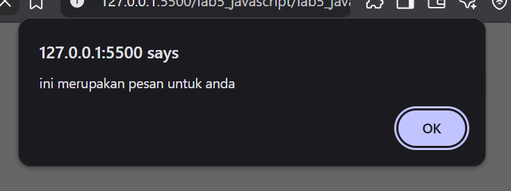
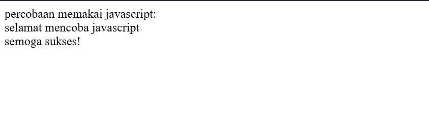
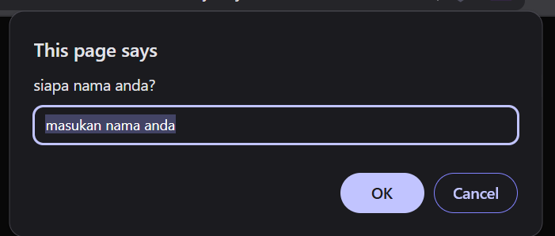
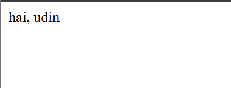
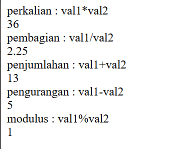
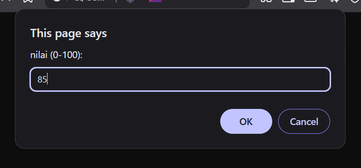
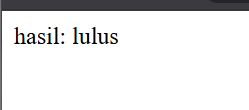
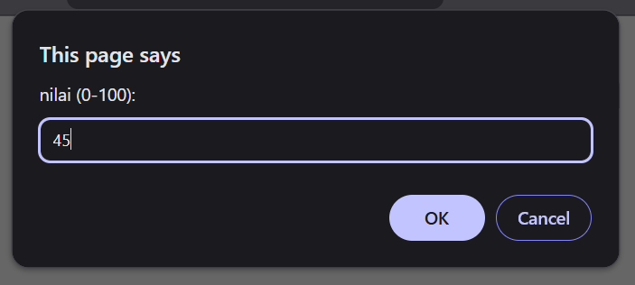
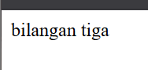
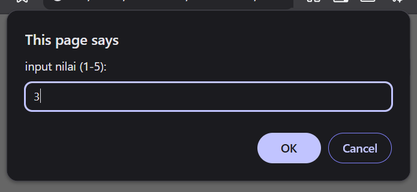

# Praktikum 5: Javascript

## Nama: Syafarudiansya
## NIM: 312410381
## Kelas: TI 24 A6

#### Penjelasan Praktikum

#### 1. Javascript dasar

##### a. Pemakaian Alert sebagai property window

`alert()` adalah fungsi bawaan (built-in function) di JavaScript yang digunakan untuk menampilkan kotak dialog pesan (message box) di browser.

```html
<html>
  <head>
    <title>alert box</title>
  </head>
  <body>
    <script language="JavaScript">
      window.alert("ini merupakan pesan untuk anda");
    </script>
  </body>
</html>
```


#### b. Pemakaian method dalam objek

Pembuatan method dalam objek berarti membuat fungsi yang dimiliki oleh suatu objek untuk menjalankan tugas tertentu. Contohnya `document.write()` — di sini `write()` adalah method milik objek document yang digunakan untuk menampilkan teks ke halaman web.

```html
<html>
  <head>
    <title>skrip javascript</title>
  </head>
  <body>
    percobaan memakai javascript:<br />
    <script>
      document.write("selamat mencoba javascript<br>");
      document.write("semoga sukses!");
    </script>
  </body>
</html>
```


#### c. Pemakaian Prompt

`prompt()` berfungsi untuk mengambil input teks dari pengguna secara langsung lewat jendela dialog.

```html
<html>
  <head>
    <title>pemasukan data</title>
  </head>
  <body>
    <script language="javascript">
      var nama = prompt("siapa nama anda?", "masukan nama anda");
      document.write("hai, " + nama);
    </script>
  </body>
</html>
```



#### d. Pembuatan fungsi dan cara pemanggilannya
   
Pembuatan fungsi adalah cara untuk menyimpan kode agar bisa digunakan kapan saja, dan pemanggilannya lewat `onload` membuat fungsi berjalan otomatis saat halaman web pertama kali dibuka.

```html
<html>
  <head>
    <title>skrip javascript</title>
    <script language="javascript">
      function pesan() {
        alert("memanggil javascript lewat body onload");
      }
    </script>
  </head>
  <body onload="pesan()"></body>
</html>
```


3. Membuat Hero Panel

Hero panel adalah bagian utama dari halaman web yang biasanya berada di bawah menu navigasi dan berfungsi untuk menarik perhatian pengunjung. Biasanya berisi judul besar, teks pengantar, dan tombol atau tautan ajakan seperti “Learn more”. Pada contoh ini, hero panel menampilkan teks “Hello World!” dengan latar abu-abu muda.

```html
<section id="hero">
        <h1>Hello World!</h1>
        <p>
          Lorem ipsum dolor sit amet, consectetur adipiscing elit. Vestibulum
          lorem elit, iaculis innisl volutpat, malesuada tincidunt arcu. Proin
          in leo fringilla, vestibulum mi porta, faucibus felis. Integer
          pharetra est nunc, nec pretium nunc pretium ac.
        </p>
        <a href="home.html" class="btn btn-large">Learn more &raquo;</a>
      </section>
```
```css
/* Hero Panel */
#hero {
background-color: #e4e4e5;
padding: 50px 20px;
margin-bottom: 20px;
}
#hero h1 {
margin-bottom: 20px;
font-size: 35px;
}
#hero p {
margin-bottom: 20px;
font-size: 18px;
line-height: 25px;
}
```


4. Mengatur layout main dan sidebar widget

Layout ini mengatur tampilan halaman menjadi tiga bagian: main content sebagai isi utama, sidebar di sampingnya untuk informasi tambahan, dan sidebar widget di dalam sidebar yang berisi tautan atau teks. CSS digunakan untuk menata ketiganya agar sejajar dan rapi.

```html
<aside id="sidebar">
          <div class="widget-box">
            <h3 class="title">Widget Header</h3>
            <ul>
              <li><a href="#">Widget Link</a></li>
              <li><a href="#">Widget Link</a></li>
              <li><a href="#">Widget Link</a></li>
              <li><a href="#">Widget Link</a></li>
              <li><a href="#">Widget Link</a></li>
            </ul>
          </div>
          <div class="widget-box">
            <h3 class="title">Widget Text</h3>
            <p>
              Vestibulum lorem elit, iaculis in nisl volutpat, malesuada
              tincidunt arcu. Proin in leo fringilla, vestibulum mi porta,
              faucibus felis. Integer pharetra est nunc, nec pretium nunc
              pretium ac.
            </p>
          </div>
        </aside>
```
```css
#wrapper {
  margin: 0;
}
#main {
  float: left;
  width: 640px;
  padding: 20px;
}
/* sidebar area */
#sidebar {
  float: left;
  width: 260px;
  padding: 20px;
}
/* widget */
.widget-box {
  border: 1px solid #eee;
  margin-bottom: 20px;
}
.widget-box .title {
  padding: 10px 16px;
  background-color: #428bca;
  color: #fff;
}
.widget-box ul {
  list-style-type: none;
}
.widget-box li {
  border-bottom: 1px solid #eee;
}
.widget-box li a {
  padding: 10px 16px;
  color: #333;
  display: block;
  text-decoration: none;
}
.widget-box li:hover a {
  background-color: #eee;
}
.widget-box p {
  padding: 15px;
  line-height: 25px;
}
```


5. Mengatur Footer

Footer adalah bagian paling bawah halaman yang biasanya berisi informasi hak cipta atau identitas situs. Pengaturannya dilakukan dengan CSS untuk memberi warna latar, mengatur teks agar sejajar di tengah atau kiri, serta menambah jarak agar tampil rapi.

```css
/* footer */
footer {
clear:both;
background-color:#1d1d1d;
padding:20px;
color:#eee;
}
```


6. Menambahkan elemen lain di main content

```html
        <section id="main">
          <div class="row">
            <div class="box">
              
              <h3>Heading</h3>
              <p>
                Donec sed odio dui. Etiam porta sem malesuada magna mollis
                euismod.
              </p>
              <a href="#" class="btn btn-default">View detail</a>
            </div>
            <div class="box">
              
              <h3>Heading</h3>
              <p>
                Donec sed odio dui. Etiam porta sem malesuada magna mollis
                euismod.
              </p>
              <a href="#" class="btn btn-default">View detail</a>
            </div>
            <div class="box">
              
              <h3>Heading</h3>
              <p>
                Donec sed odio dui. Etiam porta sem malesuada magna mollis
                euismod.
              </p>
              <a href="#" class="btn btn-default">View detail</a>
            </div>
          </div>
        </section>
```
```css
.box {
  display: block;
  float: left;
  width: 33.333333%;
  box-sizing: border-box;
  -moz-box-sizing: border-box;
  -webkit-box-sizing: border-box;
  padding: 0 10px;
  text-align: center;
}
.box h3 {
  margin: 15px 0;
}
.box p {
  line-height: 20px;
  font-size: 14px;
  margin-bottom: 15px;
}
box img {
  border: 0;
  vertical-align: middle;
}
.image-circle {
  border-radius: 50%;
}
.row {
  margin: 0 -10px;
  box-sizing: border-box;
  -moz-box-sizing: border-box;
  -webkit-box-sizing: border-box;
}
.row:after,
.row:before,
.entry:after,
.entry:before {
  content: "";
  display: table;
}
.row:after,
.entry:after {
  clear: both;
}
```


7. Menambahkan content artikel

```html
      <hr class="divider" />
        <article class="entry">
          <h2>First featurette heading.</h2>
          
          <p>
            Lorem ipsum dolor sit amet, consectetur adipiscing elit. Vestibulum
            lorem elit, iaculis in nisl volutpat, malesuada tincidunt arcu.
            Proin in leo fringilla, vestibulum mi porta, faucibus felis. Integer
            pharetra est nunc, nec pretium nunc pretium ac.
          </p>
        </article>
        <hr class="divider" />
        <article class="entry">
          <h2>First featurette heading.</h2>
          
          <p>
            Lorem ipsum dolor sit amet, consectetur adipiscing elit. Vestibulum
            lorem elit, iaculis in nisl volutpat, malesuada tincidunt arcu.
            Proin in leo fringilla, vestibulum mi porta, faucibus felis. Integer
            pharetra est nunc, nec pretium nunc pretium ac.
          </p>
        </article>
```
```css
.divider {
  border: 0;
  border-top: 1px solid #eeeeee;
  margin: 40px 0;
}
/* entry */
.entry {
  margin: 15px 0;
}
.entry h2 {
  margin-bottom: 20px;
}
.entry p {
  line-height: 25px;
}
.entry img {
  float: left;
  border-radius: 5px;
  margin-right: 15px;
}
.entry .right-img {
  float: right;
}
```


#### Pertanyaan dan Tugas
1. Layout About

```html
<!DOCTYPE html>
<html lang="id">
  <head>
    <meta charset="UTF-8" />
    <title>About - Layout Sederhana</title>
    <link rel="stylesheet" href="style.css" />
  </head>
  <body>
    <div class="container">
      <header>
        <h1>Layout Sederhana</h1>
        <nav>
          <ul>
            <li><a href="home.html">Home</a></li>
            <li><a href="artikel.html">Artikel</a></li>
            <li><a href="about.html" class="active">About</a></li>
            <li><a href="kontak.html">Kontak</a></li>
          </ul>
        </nav>
      </header>

      <section class="about">
        <h2>Tentang Saya</h2>
        <p>
          Halo! Saya Syafarudiansya, seorang mahasiswa Universitas Pelita
          Bangsa yang sedang belajar membuat website sederhana menggunakan HTML
          dan CSS. Halaman ini berisi sedikit tentang diri saya serta beberapa
          portfolio yang pernah saya buat.
        </p>

        <h3>Portfolio</h3>
        <ul>
          <li>Proyek 1 – Website Layout Sederhana</li>
          <li>Proyek 2 – Sistem Manajemen Bioskop</li>
        </ul>
      </section>

      <footer>
        <p>&copy; 2025 - Universitas Pelita Bangsa</p>
      </footer>
    </div>
  </body>
</html>
```
```css
* {
  margin: 0;
  padding: 0;
  box-sizing: border-box;
}

body {
  font-family: Arial, Helvetica, sans-serif;
  background-color: #f9f9f9;
  color: #333;
  line-height: 1.6;
}

.container {
  width: 80%;
  margin: 20px auto;
  background: #fff;
  box-shadow: 0 0 5px rgba(0, 0, 0, 0.1);
}

header {
  padding: 20px;
}

header h1 {
  color: #999;
  font-size: 26px;
}

nav {
  background: #1e73be;
}

nav ul {
  list-style: none;
  overflow: hidden;
}

nav ul li {
  float: left;
}

nav ul li a {
  display: block;
  color: #fff;
  text-decoration: none;
  padding: 10px 20px;
  font-weight: bold;
}

nav ul li a:hover,
nav ul li a.active {
  background: #0d4e8a;
}

section {
  padding: 20px;
}

.about h2 {
  margin-bottom: 15px;
  color: #333;
}

.about p {
  margin-bottom: 20px;
  text-align: justify;
}

.about h3 {
  margin-top: 20px;
  margin-bottom: 10px;
  color: #1e73be;
}

.about ul {
  list-style-type: square;
  margin-left: 20px;
}

.about ul li {
  margin-bottom: 8px;
}
```


2. Layout Kontak

```html
<!DOCTYPE html>
<html lang="id">
  <head>
    <meta charset="UTF-8" />
    <title>Kontak - Layout Sederhana</title>
    <link rel="stylesheet" href="style.css" />
  </head>
  <body>
    <div class="container">
      <header>
        <h1>Layout Sederhana</h1>
        <nav>
          <ul>
            <li><a href="home.html">Home</a></li>
            <li><a href="artikel.html">Artikel</a></li>
            <li><a href="about.html">About</a></li>
            <li><a href="kontak.html" class="active">Kontak</a></li>
          </ul>
        </nav>
      </header>

      <section class="contact">
        <h2>Hubungi Saya</h2>
        <form action="#" method="post">
          <label>Nama:</label><br />
          <input
            type="text"
            name="nama"
            placeholder="Masukkan nama"
          /><br /><br />

          <label>Email:</label><br />
          <input
            type="email"
            name="email"
            placeholder="Masukkan email"
          /><br /><br />

          <label>Pesan:</label><br />
          <textarea
            name="pesan"
            rows="5"
            placeholder="Tulis pesan..."
          ></textarea
          ><br /><br />

          <button type="submit">Kirim</button>
        </form>
      </section>

      <footer>
        <p>&copy; 2025 - Universitas Pelita Bangsa</p>
      </footer>
    </div>
  </body>
</html>
```
```css
.contact h2 {
  margin-bottom: 20px;
  color: #333;
}

.contact form {
  background: #f2f2f2;
  padding: 20px;
  border-radius: 8px;
  width: 60%;
}

.contact label {
  font-weight: bold;
}

.contact input[type="text"],
.contact input[type="email"],
.contact textarea {
  width: 100%;
  padding: 10px;
  margin-top: 6px;
  margin-bottom: 15px;
  border: 1px solid #ccc;
  border-radius: 5px;
  resize: vertical;
}

.contact button {
  background: #1e73be;
  color: #fff;
  border: none;
  padding: 10px 20px;
  border-radius: 5px;
  cursor: pointer;
}

.contact button:hover {
  background: #0d4e8a;
}

footer {
  background: #222;
  color: #fff;
  text-align: center;
  padding: 15px;
  font-size: 14px;
  margin-top: 20px;
}
```

