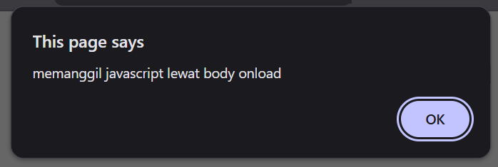
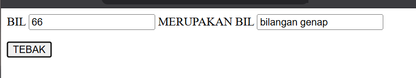

# Praktikum 5: Javascript

## Nama: Syafarudiansya
## NIM: 312410381
## Kelas: TI 24 A6

#### Penjelasan Praktikum

#### 1. Javascript dasar

##### a. Pemakaian Alert sebagai property window

`alert()` adalah fungsi bawaan (built-in function) di JavaScript yang digunakan untuk menampilkan kotak dialog pesan (message box) di browser.

```html
<html>
  <head>
    <title>alert box</title>
  </head>
  <body>
    <script language="JavaScript">
      window.alert("ini merupakan pesan untuk anda");
    </script>
  </body>
</html>
```


##### b. Pemakaian method dalam objek

Pembuatan method dalam objek berarti membuat fungsi yang dimiliki oleh suatu objek untuk menjalankan tugas tertentu. Contohnya `document.write()` — di sini `write()` adalah method milik objek document yang digunakan untuk menampilkan teks ke halaman web.

```html
<html>
  <head>
    <title>skrip javascript</title>
  </head>
  <body>
    percobaan memakai javascript:<br />
    <script>
      document.write("selamat mencoba javascript<br>");
      document.write("semoga sukses!");
    </script>
  </body>
</html>
```


##### c. Pemakaian Prompt

`prompt()` berfungsi untuk mengambil input teks dari pengguna secara langsung lewat jendela dialog.

```html
<html>
  <head>
    <title>pemasukan data</title>
  </head>
  <body>
    <script language="javascript">
      var nama = prompt("siapa nama anda?", "masukan nama anda");
      document.write("hai, " + nama);
    </script>
  </body>
</html>
```


##### d. Pembuatan fungsi dan cara pemanggilannya
   
Pembuatan fungsi adalah cara untuk menyimpan kode agar bisa digunakan kapan saja, dan pemanggilannya lewat `onload` membuat fungsi berjalan otomatis saat halaman web pertama kali dibuka.

```html
<html>
  <head>
    <title>skrip javascript</title>
    <script language="javascript">
      function pesan() {
        alert("memanggil javascript lewat body onload");
      }
    </script>
  </head>
  <body onload="pesan()"></body>
</html>
```


#### 2. Dasar Pemrograman Di Javascript

##### a. Operasi dasar aritmatika

Operasi aritmatika dalam JavaScript digunakan untuk melakukan perhitungan matematis antara dua atau lebih nilai (variabel maupun angka langsung). Pada contoh di atas, dua variabel `val1` dan `val2` digunakan sebagai operand, lalu diproses menggunakan berbagai operator seperti `*, /, +, -, dan %`.

```html
<html>
  <head>
    <title>contoh program javascript</title>

    <script language="javascript">
      function test(val1, val2) {
        document.write("<br>" + "perkalian : val1*val2 " + "<br>");
        document.write(val1 * val2);
        document.write("<br>" + "pembagian : val1/val2 " + "<br>");
        document.write(val1 / val2);
        document.write("<br>" + "penjumlahan : val1+val2 " + "<br>");
        document.write(val1 + val2);
        document.write("<br>" + "pengurangan : val1-val2 " + "<br>");
        document.write(val1 - val2);
        document.write("<br>" + "modulus : val1%val2 " + "<br>");
        document.write(val1 % val2);
      }
    </script>
  </head>
  <body>
    <input
      type="button"
      name="button1"
      value="arithmetic"
      onclick="test(9,4)"
    />
  </body>
</html>
```


##### b. Seleksi kondisi (if dan else)

Seleksi `if else` dipakai untuk mengambil keputusan berdasarkan kondisi. Jika syarat terpenuhi, kode dalam `if` dijalankan; kalau tidak, bagian `else` yang dijalankan. Contohnya, kalau nilai ≥ 60 maka “lulus”, selain itu “tidak lulus”.

```html
<html>
  <head>
    <title>contoh if-else</title>
  </head>
  <body>
    <script language="javascript">
      var nilai = prompt("nilai (0-100): ", 0);
      var hasil = "";
      if (nilai >= 60) hasil = "lulus";
      else hasil = "tidak lulus";
      document.write("hasil: " + hasil);
    </script>
  </body>
</html>
```


##### c. Penggunaan operator switch untuk seleksi kondisi

`Switch` digunakan untuk memilih tindakan berdasarkan nilai tertentu. Tiap case mewakili kemungkinan nilai, dan program menjalankan kode pada `case` yang cocok. Jika tidak ada yang cocok, bagian `default` dijalankan.

```html
<html>
  <head>
    <title>contoh program javascript</title>

    <script language="javascript">
      function test() {
        val1 = window.prompt("input nilai (1-5):");
        switch (val1) {
          case "1":
            document.write("bilangan satu");
            break;
          case "2":
            document.write("bilangan dua");
            break;
          case "3":
            document.write("bilangan tiga");
            break;
          case "4":
            document.write("bilangan empat");
            break;
          case "5":
            document.write("bilangan lima");
            break;
          default:
            document.write("bilangan lainnya");
        }
      }
    </script>
  </head>
  <body>
    <input type="button" name="button1" value="switch" onclick="test()" />
  </body>
</html>
```


#### 3. Pembuatan Form

##### a. Form Input

Form input digunakan untuk menerima data dari pengguna melalui elemen seperti kotak teks atau tombol. Dalam contohmu, pengguna memasukkan angka, lalu saat tombol ditekan, program memproses input tersebut dan menampilkan hasilnya — apakah angka itu bilangan genap atau ganjil.

```html
<html>
  <head>
    <script language="javascript">
      function test() {
        var val1 = document.kirim.T1.value;
        if (val1 % 2 == 0) document.kirim.T2.value = "bilangan genap";
        else document.kirim.T2.value = "bilangan ganjil";
      }
    </script>
  </head>
  <body>
    <form method="POST" name="kirim">
      <p>
        BIL <input type="text" name="T1" size="20" /> MERUPAKAN BIL
        <input type="text" name="T2" size="20" />
      </p>
      <p><input type="button" value="TEBAK" name="BT" onclick="test()" /></p>
    </form>
  </body>
</html>
```



##### b. Form Button

Form button digunakan untuk menjalankan aksi ketika tombol diklik. Dalam contohmu, setiap tombol punya fungsi berbeda — misalnya mengubah warna latar belakang atau warna teks. Jadi, saat pengguna menekan tombol, JavaScript akan mengeksekusi perintah sesuai fungsi tombol tersebut.

```html
<html>
  <head>
    <title>objek document</title>
  </head>
  <body>
    <script language="javascript">
      function ubahWarnaLB(warna) {
        document.bgColor = warna;
      }
      function ubahWarnaLD(warna) {
        document.fgColor = warna;
      }
    </script>

    <h1>tes</h1>
    <form>
      <input
        type="button"
        value="Latar Belakang Hijau"
        onClick="ubahWarnaLB('GREEN')"
      />
      <input
        type="button"
        value="Latar Belakang Putih"
        onClick="ubahWarnaLB('WHITE')"
      />
      <input
        type="button"
        value="Teks Kuning"
        onClick="ubahWarnaLD('YELLOW')"
      />
      <input type="button" value="Teks Hitam" onClick="ubahWarnaLD('BLACK')" />
    </form>

    <script language="javascript">
      document.write("Dimodifikasi terakhir pada " + document.lastModified);
    </script>
  </body>
</html>
```


#### 4. HTML DOM

##### a. Pilihan menggunakan checkbox dengan perhitungan otomatis

Menghitung total harga makanan secara otomatis. Saat pengguna mencentang atau melepas checkbox menu, fungsi hitungTotal() akan menjumlahkan harga dari menu yang dipilih dan menampilkannya di kotak “Total Bayar”.

```html
<html>
  <head>
    <title>Daftar Menu</title>
    <script>
      function Hitung(ele) {
        var total = document.getElementById("total").value;
        total = total ? parseInt(total) : 0;
        var harga = 0;

        if (ele.checked) {
          harga = ele.value;
          total += parseInt(harga);
        } else {
          harga = ele.value;
          if (total >= harga) {
            total -= parseInt(harga);
          }
        }

        document.getElementById("total").value = total;
      }
    </script>
  </head>
  <body>
    <h3>Daftar Menu Makanan</h3>
    <label
      ><input type="checkbox" value="5000" id="m1" onclick="Hitung(this)" />
      Ayam Goreng Rp. 5,000</label
    ><br />
    <label
      ><input type="checkbox" value="5000" id="m2" onclick="Hitung(this)" />
      Tempe Goreng Rp. 5,000</label
    ><br />
    <label
      ><input type="checkbox" value="2000" id="m3" onclick="Hitung(this)" />
      Telur Dadar Rp. 2,000</label
    ><br />
    <strong>Total Bayar: Rp. <input id="total" /></strong>
  </body>
</html>

```


#### Pertanyaan dan Tugas

##### 1. Buat script untuk melakukan validasi pada isian form

```html
<html>
  <head>
    <title>Validasi Form</title>
  </head>
  <body>
    <h2>Form Pendaftaran</h2>
    <form onsubmit="return validasiForm()">
      Nama: <input type="text" id="nama" /><br /><br />
      Email: <input type="text" id="email" /><br /><br />
      <input type="submit" value="Kirim" />
    </form>

    <script>
      function validasiForm() {
        var nama = document.getElementById("nama").value;
        var email = document.getElementById("email").value;

        if (nama == "" || email == "") {
          alert("Nama dan Email harus diisi!");
          return false; // hentikan pengiriman form
        }
        alert("Data berhasil dikirim!");
        return true;
      }
    </script>
  </body>
</html>
```


